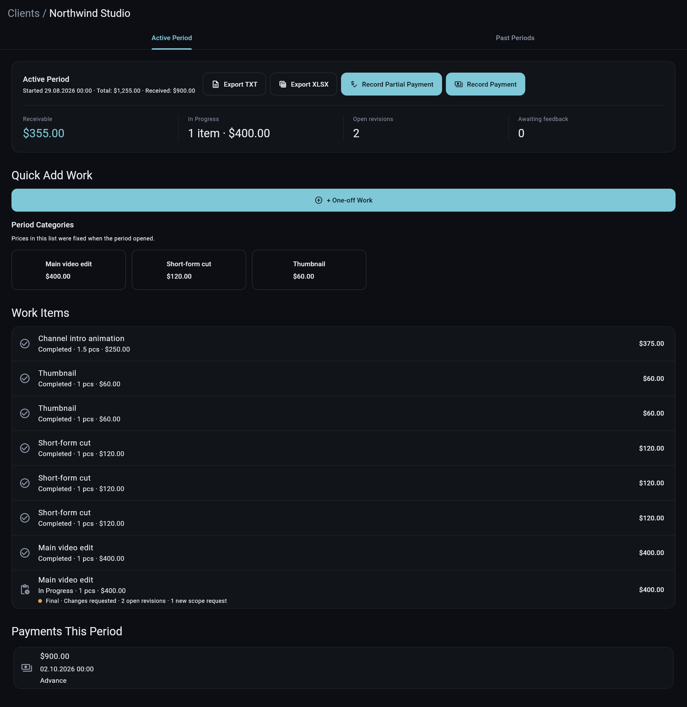
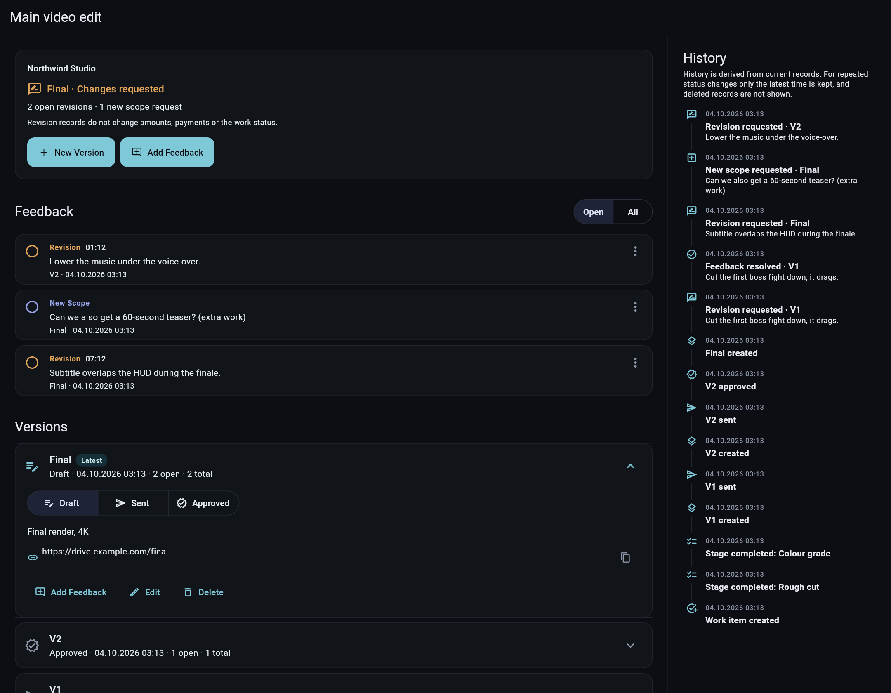
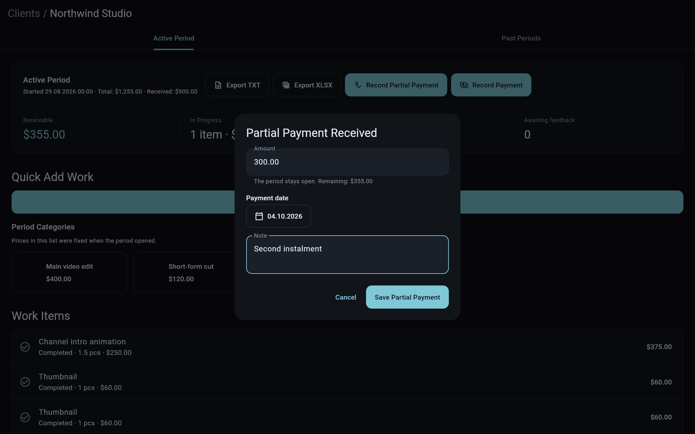
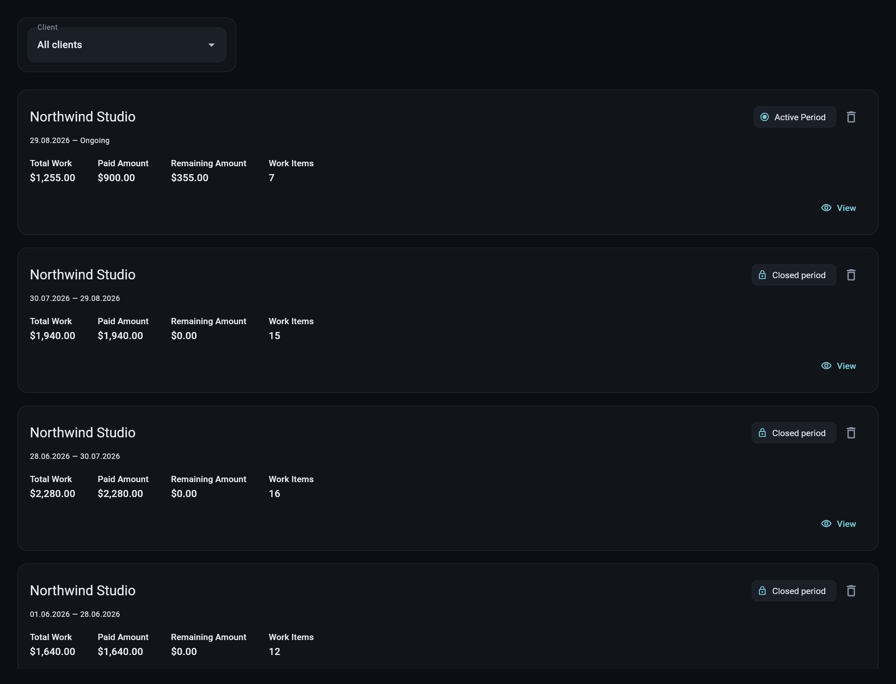
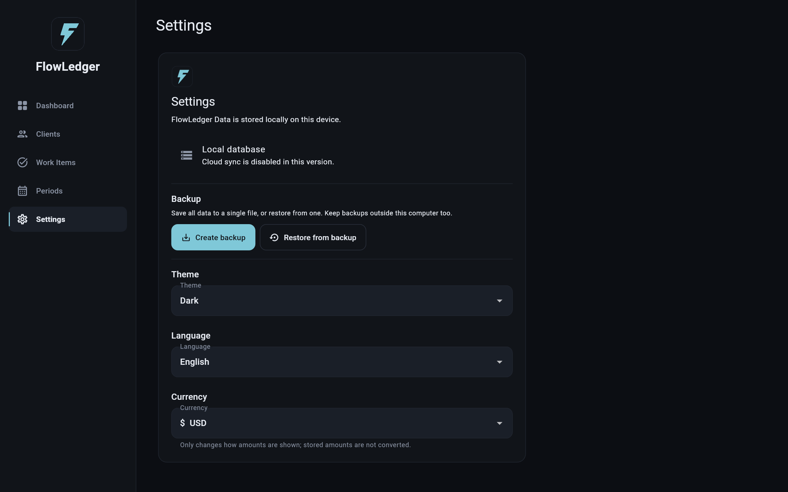
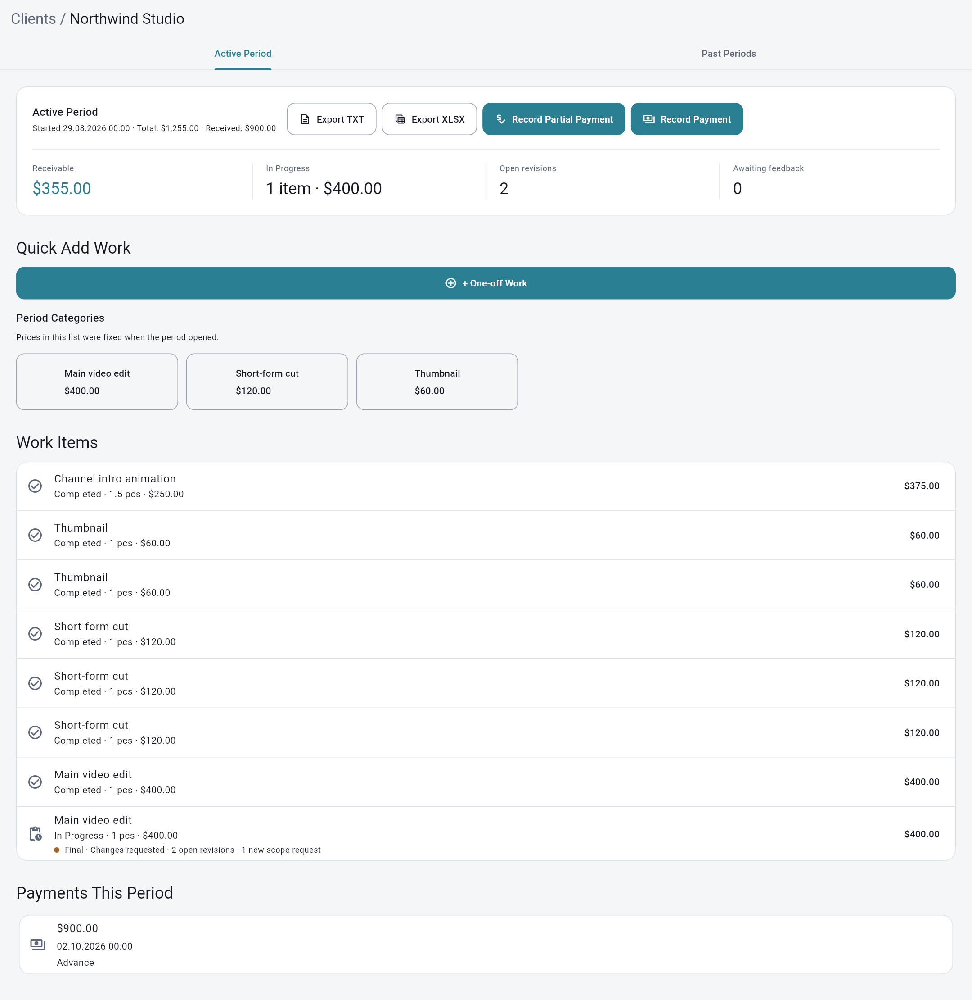

# FlowLedger

**A local-first work, revision and payment tracker for freelancers.**

FlowLedger keeps track of what you did for each client, which version you sent, what the client asked to change, and how much they still owe you — all on your own computer. No account, no cloud, no subscription.

> FlowLedger 1.0 is the first public release. It is used daily by its author; as with any tool that holds your records, back up your data regularly (Settings → Backup).

## Product overview

A 20-second look at work, revisions and payments in FlowLedger.

**English**

https://github.com/user-attachments/assets/80a17291-332c-4ba8-a417-d6822ef2498c

Türkçe tanıtım videosu

https://github.com/user-attachments/assets/6b07ae5f-1a45-4907-bc6d-cadc98a2c3eb

## Screenshots

Scroll through the main screens below (dark theme; light theme is also available). All data shown is made-up demo data.

### Client detail
Total, received and remaining amounts, open revisions and the work list for the active period.

### Revisions
Versions (V1, V2, Final) with Draft / Sent / Approved status, timecoded client feedback and a history timeline.

### Partial payment
Record a partial payment; the period stays open and the remaining balance is shown.

### Periods archive
Active and closed periods with total work, paid and remaining amounts.

### Settings
Language (English, Turkish, German, Russian), currency, theme and backup.

### Light theme

## Features

- **Clients and billing periods** — record work per client in an open period; close the period when you get paid and a new one starts automatically.
- **Categories with fixed prices** — define your usual services and prices per client. Prices are frozen when a period opens, so later price changes never rewrite history.
- **Work items with stages** — quantity, an optional multiplier (for example ×1.5 for rush jobs), notes and a checklist of stages.
- **Revisions** — for each work item, keep versions (V1, V2, Final…) with a status (Draft / Sent / Approved) and a file or link, plus client feedback marked as *Revision* or *New scope*, with optional video timecodes. Revision records never change amounts or payments.
- **History** — a timeline of each work item built from your records.
- **Payments** — full or partial payments, remaining balance, closed-period archive.
- **Reports** — export the active period as TXT or Excel (XLSX).
- **Backup and restore** — save everything to a single file and restore it later, with a safety copy of your current data taken first.
- **Four languages** — English, Turkish, German, Russian.
- **Currency** — ₺, $, €, £, ₽ or CHF (display only; amounts are not converted).
- Light and dark theme.

## Download and install (Windows)

1. Open the [Releases page](../../releases) and download `FlowLedger-windows-x64.zip` from the latest release.
2. Extract the zip to a folder of your choice, for example `C:\Programs\FlowLedger`. Keep all files together — the `.exe` needs the `data` folder and `.dll` files next to it.
3. Run `flowledger.exe`.

**Windows SmartScreen warning:** FlowLedger is not code-signed yet, so Windows may show "Windows protected your PC". Click **More info → Run anyway**. If you prefer, you can [build it yourself](CONTRIBUTING.md) from the source code.

Requirements: Windows 10 or 11, 64-bit. Only Windows is supported at the moment.

## First steps

1. Pick your language.
2. Go to **Settings** and choose your currency.
3. **Clients → Add client.** Open the client and add your usual services under *Default categories* (name, price, optional stages).
4. Add work from the category buttons or with **+ One-off work**.
5. Open a work item's **Revisions** to track versions and client feedback.
6. When the client pays, use **Record payment** to close the period.

A longer walkthrough is in the [user guide](docs/USER_GUIDE.md) ([Türkçe kullanım rehberi](docs/KULLANIM_REHBERI.md)).

## Your data

- Everything is stored in a single SQLite database on your computer:
  `%APPDATA%\com.burry.flowledger\FlowLedger\flowledger.db`
- Nothing is sent anywhere. FlowLedger has no telemetry and no network features.
- A fresh install starts with an empty database.
- **Backups:** Settings → Backup → *Create backup* writes one `.db` file. Keep copies outside your computer (USB drive, your own cloud folder).
- **Restore:** Settings → Backup → *Restore from backup*. The file is checked first, and your current data is saved to a safety copy named `flowledger.pre-restore-<time>.db` next to the database before anything is replaced.
- Before a database upgrade, FlowLedger automatically writes a copy named `flowledger.v<old version>-backup-<time>.db` next to the database. These copies are never deleted automatically.
- Upgrading from 0.1: the old database (`%APPDATA%\com.example\FlowLedger\burry_ledger.db`) is copied to the new folder as `flowledger.db` on first start. The old files are left in place; you can delete them once you have checked your data.

## Updating

Download the new release, close FlowLedger, and replace the program folder. Your data lives in `%APPDATA%` and is not touched by replacing the program files. Creating a backup first is always a good idea.

## Known limitations

- Windows only. Phone sync is planned but not available yet.
- The revision history is built from current records: when a status changes several times, only the latest time is kept, and deleted records are not shown.
- German and Russian translations have not been reviewed by native speakers yet — corrections are very welcome.
- Currency is display-only; FlowLedger does not convert between currencies.

## Contributing

Bug reports, translation fixes and pull requests are welcome. See [CONTRIBUTING.md](CONTRIBUTING.md) for how to build, test and add translations.

## License

FlowLedger is free software, licensed under the [GNU General Public License v3.0](LICENSE). You may use, study, share and modify it; if you distribute a modified version, you must share its source code under the same license.
